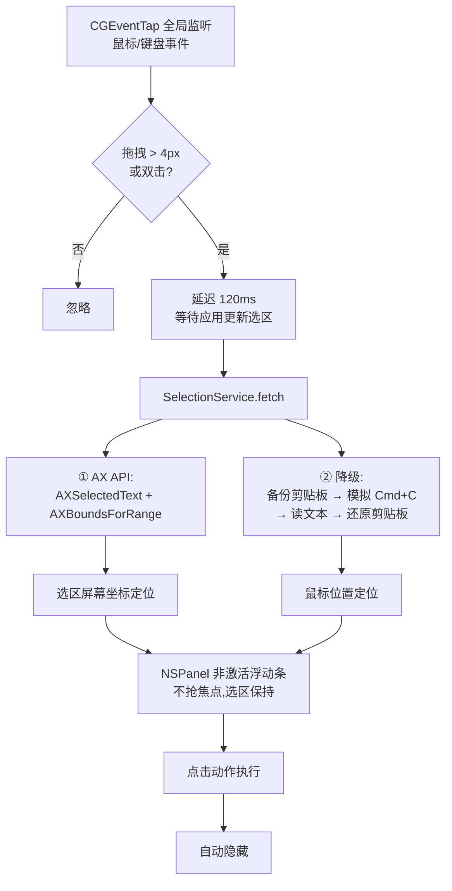

<p align="center">
  
</p>

<h1 align="center">PopBar</h1>

<p align="center">
  一个 PopClip 风格的 macOS 划词工具条 —— 选中文字,即出菜单。<br>
  纯 Swift + AppKit 实现,无 Xcode 工程依赖,单文件编译打包。
</p>

<p align="center">
  <br>
  
</p>

## 特性

- **划词即弹**:鼠标拖拽 / 双击选中文字后,浮动工具条出现在选区上方
- **13 个内置动作**:覆盖剪贴板、文本处理、搜索、翻译、语音等常用场景
- **上下文感知**:识别 URL / 邮箱 / 算式,自动追加对应按钮
- **无侵入取词**:优先 Accessibility API,降级为模拟 `Cmd+C` 并自动还原剪贴板
- **就地替换**:大小写转换、文本清理直接替换原文(剪贴板先备份后还原)
- **明暗双主题**:毛玻璃材质与图标颜色随系统外观自适应
- **零依赖后台运行**:`LSUIElement` 无 Dock 图标,纯事件驱动,空闲 CPU ≈ 0

## 按钮一览

| 图标 | 动作 | 说明 |
|---|---|---|
| 📄 | 复制 | 选中文字写入剪贴板 |
| ✂️ | 剪切 | 模拟 `Cmd+X` |
| 📋 | 粘贴 | 模拟 `Cmd+V` |
| Aa | 大小写转换 | 就地替换;全大写则转小写 |
| ✨ | 清理文本 | 换行合并为空格、压缩空白,就地替换 |
| 🔍 | Google 搜索 | 浏览器打开搜索结果 |
| 🐾 | 百度搜索 | 同上 |
| 🌐 | 翻译 | Google 翻译,中→英 / 其他→中自动判断 |
| ⓑ | Bob 翻译 | 发送 `⌥D` 唤起 Bob 划词翻译;未运行自动拉起,未安装则提示 |
| 📖 | 词典 | 调起 macOS 词典(`dict://`) |
| 🔊 | 朗读/停止 | AVSpeechSynthesizer,中文自动选中文语音 |
| #️⃣ | 字数统计 | 弹条内直接显示「字符 X · 词 Y」 |
| 🔗 | 打开链接 | 仅当选中内容像 URL 时出现 |
| ✉️ | 发邮件 | 仅当选中内容是邮箱时出现 |
| ⊖ | 计算 | 仅当选中内容是算式时出现,复制结果 |

## 工作原理



关键实现:

- **事件监听** `.cgSessionEventTap` + `listenOnly`,不阻断系统事件流
- **取词降级链** AX → 剪贴板快照/还原(`(type, Data)` 物化,规避懒加载 item 的 `writeObjects:` 崩溃)
- **面板** `NSPanel` + `.nonactivatingPanel`,点击按钮时前台 App 焦点与选区不丢失——这是 ⌥D 唤起 Bob 等功能成立的前提
- **悬停反馈** `NSTrackingArea` + `.activeAlways`,accessory 应用下依然生效
- **Chrome/Electron 兼容** 自动设置 `AXEnhancedUserInterface`

## 构建与安装

```bash
./build.sh          # 编译并打包 build.noindex/PopBar.app
./build.sh --dmg    # 将现有 App 打包为 build/PopBar-<版本>-<架构>.dmg，不重新编译或签名
```

打开 DMG，把 `PopBar.app` 拖到 `Applications` 文件夹，再从「应用程序」启动。应用只在菜单栏显示图标，不占用 Dock。也可直接运行本地构建：`open build.noindex/PopBar.app`。构建与打包暂存目录采用 `.noindex` 后缀，避免开发副本出现在系统应用搜索结果中。

要求:macOS 13+；源码构建需要 Swift 工具链（Xcode 或 Command Line Tools）。重复执行 `--dmg` 前，请先将已有同名 DMG 移走，脚本不会覆盖它。

## 权限

首次启动需授予 **系统设置 → 隐私与安全性 → 辅助功能**:

- 全局事件监听(划词检测)
- 读取选中文字
- 模拟按键(`Cmd+C/X/V`、`⌥D`)

> 安装 DMG 不会自动授予辅助功能权限。若系统列表中没有 PopBar，可在该页面点「+」并选择 `/Applications/PopBar.app`。本机若存在 `PopBar Dev` 证书则用它签名，否则回退 ad-hoc 签名；这两种方式都不是 Apple Developer ID 签名或公证，跨设备分发可能遇到 Gatekeeper 阻止，且无法保证辅助功能授权在更新后保持有效。

## 项目结构

```
popbar/
├── Sources/
│   ├── main.swift                    # 入口
│   ├── AppDelegate.swift             # 状态栏菜单 / 权限引导
│   ├── SelectionMonitor.swift        # CGEventTap 划词手势识别
│   ├── SelectionService.swift        # AX 取词 + 剪贴板降级/快照还原
│   ├── FloatingBarController.swift   # 浮动条 UI、全部动作、悬停按钮
│   ├── Actions.swift                 # CGEvent 按键模拟(含 flagsChanged)
│   └── Screen.swift                  # CG/AX ↔ Cocoa 坐标系转换
├── shot/main.swift                   # 截图工具(独立可执行,复用 Sources)
├── icon/make_icon.swift              # 图标生成器(矢量绘制 → iconset)
├── Resources/AppIcon.icns
├── docs/                             # README 截图
├── build.sh                          # App/DMG 打包
├── build/                            # 编译产物与 DMG（不入库）
└── build.noindex/                    # 开发 App 与打包暂存（不参与 Spotlight 索引）
```

## 工具脚本

```bash
# 重新生成图标(改 icon/make_icon.swift 中的配色/布局后执行)
swift icon/make_icon.swift icon/PopBar.iconset icon/preview.png
iconutil -c icns icon/PopBar.iconset -o Resources/AppIcon.icns

# 重新生成 README 里的弹条截图(浅色+深色)
swiftc -O -o build/shot Sources/Screen.swift Sources/FloatingBarController.swift \
       Sources/SelectionService.swift Sources/Actions.swift shot/main.swift
./build/shot docs/popbar-bar-light.png docs/popbar-bar-dark.png
```

## 已知限制

- 无扩展系统(PopClip 的 YAML+JS 插件机制未实现,动作均为内置)
- 完全无 AX 支持的应用里只能靠剪贴板降级取词,位置精度降为鼠标位置
- 当前没有 Developer ID 签名和 Apple 公证；DMG 适合本机安装/内部测试，公开分发需按 Apple 要求签名、公证

## License

仅供学习交流使用。
