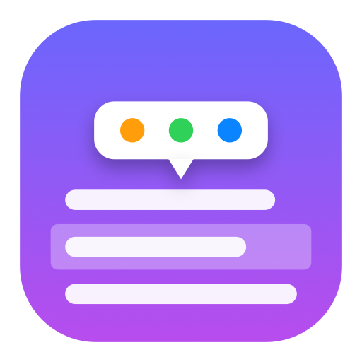
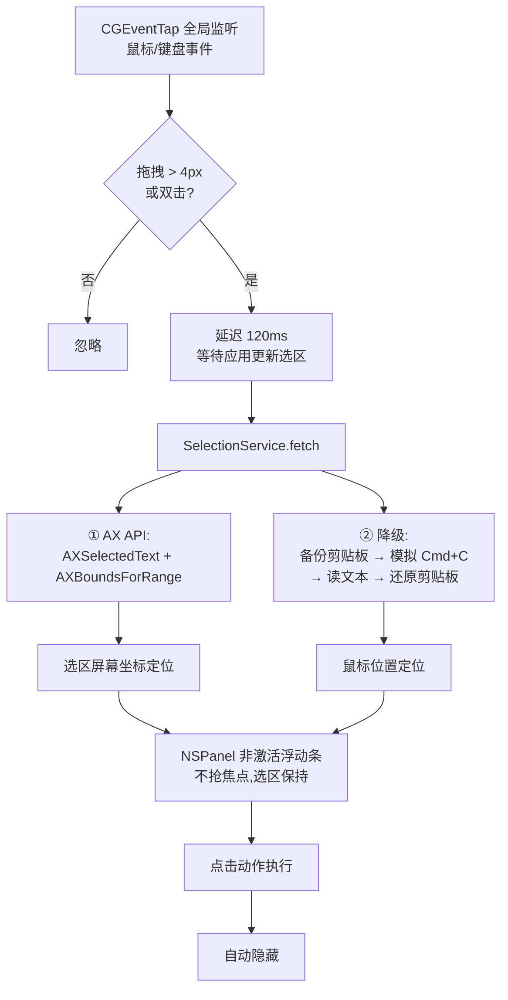
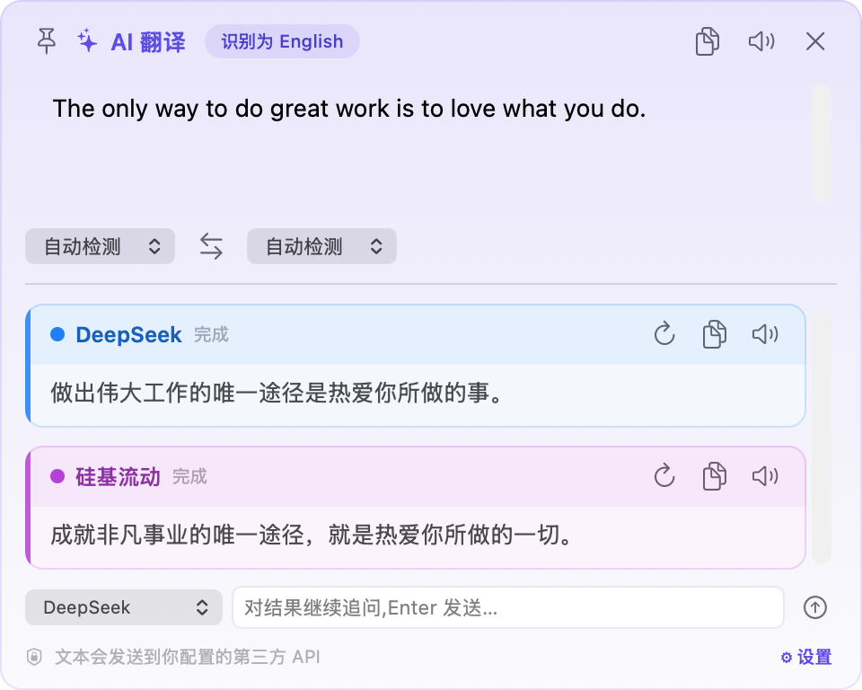
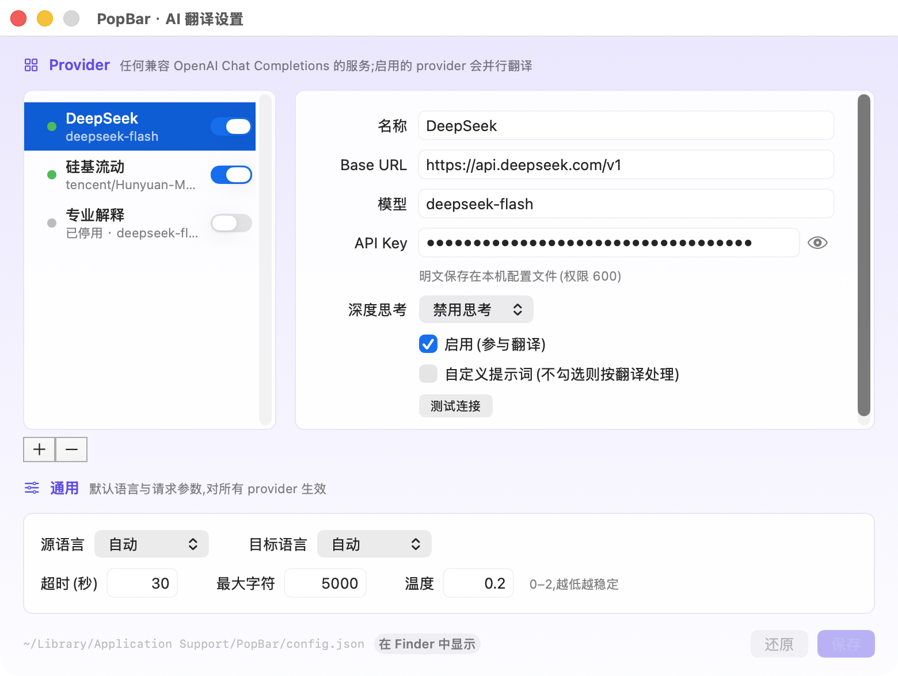
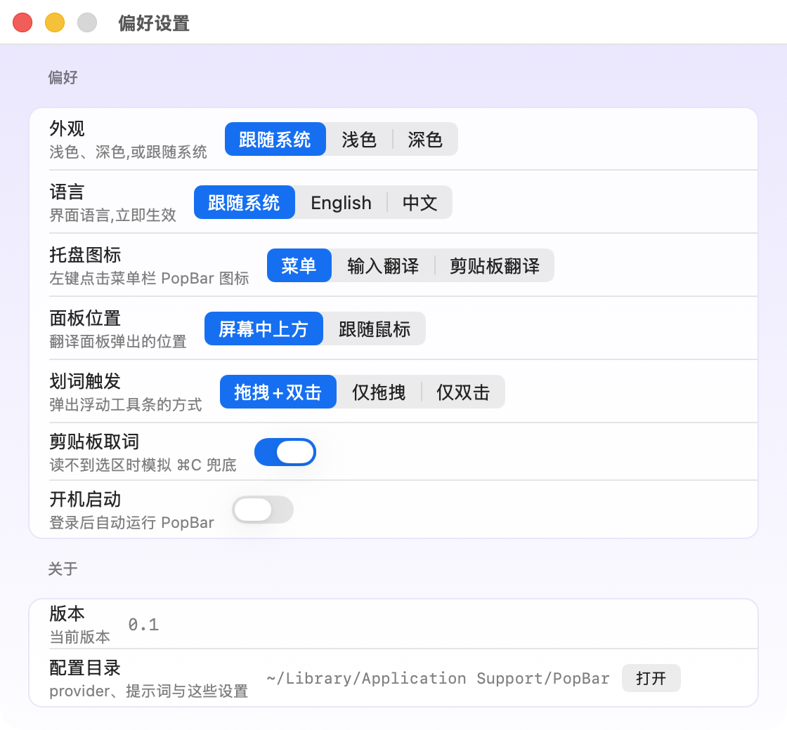

<p align="center">
  
</p>

<h1 align="center">PopBar</h1>

<p align="center">
  一个 PopClip 风格的 macOS 划词工具条 —— 选中文字,即出菜单。<br>
  纯 Swift + AppKit 实现,无 Xcode 工程依赖,单文件编译打包。
</p>

<p align="center">
  <br>
  
</p>

## 特性

- **划词即弹**:鼠标拖拽 / 双击选中文字后,浮动工具条出现在选区上方
- **13 个内置动作**:覆盖剪贴板、文本处理、搜索、翻译、语音等常用场景
- **AI 翻译面板**:接入任意 OpenAI 兼容服务(DeepSeek / 硅基流动 / Ollama…),多个 provider 并行流式返回译文对比
- **上下文感知**:识别 URL / 邮箱 / 算式,自动追加对应按钮
- **无侵入取词**:优先 Accessibility API,降级为模拟 `Cmd+C` 并自动还原剪贴板
- **就地替换**:大小写转换、文本清理直接替换原文(剪贴板先备份后还原)
- **明暗双主题**:毛玻璃材质与图标颜色随系统外观自适应
- **零依赖后台运行**:`LSUIElement` 无 Dock 图标,纯事件驱动,空闲 CPU ≈ 0

## 按钮一览

| 图标 | 动作 | 说明 |
|---|---|---|
| 📄 | 复制 | 选中文字写入剪贴板 |
| ✂️ | 剪切 | 模拟 `Cmd+X` |
| 📋 | 粘贴 | 模拟 `Cmd+V` |
| Aa | 大小写转换 | 就地替换;全大写则转小写 |
| ✨ | 清理文本 | 换行合并为空格、压缩空白,就地替换 |
| 🔍 | Google 搜索 | 浏览器打开搜索结果 |
| 🐾 | 百度搜索 | 同上 |
| 🌐 | 翻译 | Google 翻译,中→英 / 其他→中自动判断 |
| 💬 | AI 翻译 | 打开多 provider 翻译面板,流式显示各家译文;未配置 provider 时打开设置窗口 |
| 📖 | 词典 | 调起 macOS 词典(`dict://`) |
| 🔊 | 朗读/停止 | AVSpeechSynthesizer,中文自动选中文语音 |
| #️⃣ | 字数统计 | 弹条内直接显示「字符 X · 词 Y」 |
| 🔗 | 打开链接 | 仅当选中内容像 URL 时出现 |
| ✉️ | 发邮件 | 仅当选中内容是邮箱时出现 |
| ⊖ | 计算 | 仅当选中内容是算式时出现,复制结果 |

## 工作原理



关键实现:

- **事件监听** `.cgSessionEventTap` + `listenOnly`,不阻断系统事件流
- **取词降级链** AX → 剪贴板快照/还原(`(type, Data)` 物化,规避懒加载 item 的 `writeObjects:` 崩溃)
- **面板** `NSPanel` + `.nonactivatingPanel`,点击按钮时前台 App 焦点与选区不丢失——模拟按键替换选区等操作都依赖这一点
- **悬停反馈** `NSTrackingArea` + `.activeAlways`,accessory 应用下依然生效
- **Chrome/Electron 兼容** 自动设置 `AXEnhancedUserInterface`

## AI 翻译面板

<p align="center">
  
</p>

点击弹条上的 💬 按钮,会打开一个 PopClip 风格的翻译面板:顶部是原文(可选中、可朗读),
下面是每个 provider 一张卡片,译文**流式**逐字出现;每张卡片都有复制、朗读和重试,
失败的 provider 会单独显示错误,不影响其它家。面板出现在屏幕中上方,左上角 📌 可钉住
(钉住后点击面板外不关闭,Esc/✕ 仍可关)。

菜单栏还提供三种触发方式:

| 入口 | 说明 |
|---|---|
| 截图翻译(OCR) | 系统选区截图 → Vision 离线 OCR(中英)→ 进面板翻译;需要「屏幕录制」权限,首次会引导授权 |
| 输入翻译 | 面板原文区变为输入框,Enter 提交、Shift+Enter 换行,可反复修改重译 |
| 剪贴板翻译 | 剪贴板是文本直接翻;是图片则先 OCR 再翻 |

### 设置窗口

<p align="center">
  
</p>

菜单栏 →「AI 翻译设置…」打开设置窗口:左侧 provider 列表(绿点可用 / 橙点缺 key 或模型 / 灰点停用),
行内开关直接启停,**拖拽即可排序**(顺序即面板卡片顺序);右侧编辑名称、Base URL、模型、API Key、
深度思考与启用状态;「+」可选 DeepSeek、硅基流动、OpenAI、OpenRouter、Ollama 等预设,
「测试连接」会真实请求一次并显示耗时。下方是默认语言、超时、最大字符与温度。
点「保存」(⌘S)写回配置文件,有未保存修改时关闭窗口会提示。

### 偏好设置

<p align="center">
  
</p>

菜单栏 →「偏好设置…」(⌘,)打开,改动**即时生效**,不需要点保存:

| 项 | 说明 |
|---|---|
| 外观 | 跟随系统 / 浅色 / 深色,立即切换所有窗口与面板 |
| 语言 | 跟随系统 / English / 中文,菜单栏、浮动条、翻译面板双语即时切换 |
| 托盘图标 | 左键点菜单栏图标的行为:菜单 / 输入翻译 / 剪贴板翻译(右键始终弹菜单) |
| 面板位置 | 翻译面板弹在屏幕中上方 / 跟随鼠标 |
| 划词触发 | 拖拽+双击 / 仅拖拽 / 仅双击 |
| 剪贴板取词 | AX 读不到选区时是否允许模拟 ⌘C 兜底(关掉更保护剪贴板隐私) |
| 开机启动 | SMAppService 登录项,与系统设置 → 登录项 同步 |

「关于」区显示版本号和配置目录,可一键在 Finder 打开。

### 配置文件

配置保存在 `~/Library/Application Support/PopBar/config.json`(首次启动自动生成,权限 0600;
若存在早期版本的 `~/.config/popbar/config.json` 会自动迁移过来,旧文件保留)。

- **启动时加载,运行时自动刷新**:PopBar 监听该文件,外部编辑器保存后约 0.3 秒生效,无需重启
- JSON 写坏时保留上一次的有效配置,并在设置窗口提示错误
- 也可以直接手写,格式如下:

```json
{
  "appearance": "system",
  "language": "system",
  "trayClick": "menu",
  "panelPosition": "top",
  "triggerMode": "both",
  "clipboardFallback": true,
  "launchAtLogin": false,
  "sourceLanguage": "auto",
  "targetLanguage": "auto",
  "timeout": 30,
  "maxCharacters": 5000,
  "temperature": 0.2,
  "providers": [
    {
      "name": "DeepSeek",
      "baseURL": "https://api.deepseek.com/v1",
      "model": "deepseek-chat",
      "apiKey": "sk-你的key",
      "enabled": true
    },
    {
      "name": "本地 Ollama",
      "baseURL": "http://127.0.0.1:11434/v1",
      "model": "qwen2.5:7b",
      "apiKey": "ollama",
      "enabled": true
    },
    {
      "name": "词汇解释",
      "baseURL": "https://api.deepseek.com/v1",
      "model": "deepseek-chat",
      "apiKey": "sk-你的key",
      "enabled": true,
      "systemPrompt": "你是一名专业词汇解释助手。",
      "userPrompt": "请解释这个词:{$query.text}"
    }
  ]
}
```

- 任何 **OpenAI 兼容**服务都能用:填 `baseURL` + `model` + `apiKey` 即可,`enabled` 控制启用
- **深度思考**:每个 provider 可选「默认设置 / 启用思考 / 禁用思考」,按域名适配各家写法(DeepSeek `thinking.type`、OpenRouter `reasoning`、Qwen/硅基流动/vLLM 系 `enable_thinking`),未知服务走通用写法
- **自定义提示词**:provider 勾选「自定义提示词」后可改系统提示词和用户指令模板(把划词弹条变成解释、改写等任意任务)。模板变量:`$query.text` 原文、`$query.detectFromLang` 源语言、`$query.detectToLang` 目标语言(`{$…}` 带花括号的写法也认);面板仍按翻译样式流式展示结果。系统提示词留空则不发 system 消息
- `apiKey` 在设置窗口里填写,以明文保存在配置文件(权限 0600,仅本机当前用户可读)
- `targetLanguage` 为 `auto` 时按原文自动判断方向(中文→英文,其它→中文)
- 面板里的语言下拉可以临时改方向,改动只对本次生效,不写回配置
- 支持本地服务(`http://127.0.0.1:...`,已在 Info.plist 声明 `NSAllowsLocalNetworking`)

> ⚠️ 使用该功能时,选中的文字会发送到**你自己配置的第三方 API**(或本地模型)。
> PopBar 本身没有服务端,不收集任何数据,但目标服务商的隐私政策适用于这次请求。
> `apiKey` 以明文保存在本机配置文件里(仅本机当前用户可读);如需更安全的存储,请改用本地模型(如 Ollama)。

## 构建与安装

```bash
./build.sh    # 一条命令:编译 → 打包 build.noindex/PopBar.app → 生成 build/PopBar-<版本>-<架构>.dmg
```

App 每次先删后增干净重建；同名 dmg 直接覆盖；打包暂存目录用完自动清理。打开 DMG，把 `PopBar.app` 拖到 `Applications` 文件夹，再从「应用程序」启动。应用只在菜单栏显示图标，不占用 Dock。也可直接运行本地构建：`open build.noindex/PopBar.app`。构建与打包暂存目录采用 `.noindex` 后缀，避免开发副本出现在系统应用搜索结果中。

要求:macOS 13+；源码构建需要 Swift 工具链（Xcode 或 Command Line Tools）。

## 权限

首次启动需授予 **系统设置 → 隐私与安全性 → 辅助功能**:

- 全局事件监听(划词检测)
- 读取选中文字
- 模拟按键(`Cmd+C/X/V`、`⌥D`)

> AI 翻译面板需要网络访问(出站 HTTPS);其余动作全部离线。只有你主动使用搜索、在线翻译或 AI 翻译时,选中的文字才会被发送到对应服务。

> 安装 DMG 不会自动授予辅助功能权限。若系统列表中没有 PopBar，可在该页面点「+」并选择 `/Applications/PopBar.app`。本机若存在 `PopBar Dev` 证书则用它签名，否则回退 ad-hoc 签名；这两种方式都不是 Apple Developer ID 签名或公证，跨设备分发可能遇到 Gatekeeper 阻止，且无法保证辅助功能授权在更新后保持有效。

## 项目结构

```
popbar/
├── Sources/
│   ├── main.swift                    # 入口
│   ├── AppDelegate.swift             # 状态栏菜单 / 权限引导
│   ├── SelectionMonitor.swift        # CGEventTap 划词手势识别
│   ├── SelectionService.swift        # AX 取词 + 剪贴板降级/快照还原
│   ├── FloatingBarController.swift   # 浮动条 UI、全部动作、悬停按钮
│   ├── TranslationPanel.swift        # AI 翻译面板(原文 + provider 卡片)
│   ├── LLMClient.swift               # OpenAI 兼容流式客户端 + 提示词/语言判断
│   ├── PopBarConfig.swift            # config.json 结构、路径、迁移与读写
│   ├── ConfigStore.swift             # 启动加载 + 文件监听热重载 + 变更通知
│   ├── SettingsWindow.swift          # AI 翻译设置窗口(provider 增删改、测试连接)
│   ├── PreferencesWindow.swift       # 偏好设置窗口(通用选项,即时生效)
│   ├── TranslateTriggers.swift       # 截图 OCR / 输入 / 剪贴板翻译触发器
│   ├── L10n.swift                    # 中/英双语界面字符串
│   ├── Actions.swift                 # CGEvent 按键模拟(含 flagsChanged)
│   └── Screen.swift                  # CG/AX ↔ Cocoa 坐标系转换
├── shot/main.swift                   # 截图工具(独立可执行,复用 Sources)
├── icon/make_icon.swift              # 图标生成器(矢量绘制 → iconset)
├── Resources/AppIcon.icns
├── docs/                             # README 截图
├── build.sh                          # App/DMG 打包
├── build/                            # 编译产物与 DMG（不入库）
└── build.noindex/                    # 开发 App 与打包暂存（不参与 Spotlight 索引）
```

## 工具脚本

```bash
# 重新生成图标(改 icon/make_icon.swift 中的配色/布局后执行)
swift icon/make_icon.swift icon/PopBar.iconset icon/preview.png
iconutil -c icns icon/PopBar.iconset -o Resources/AppIcon.icns

# 重新生成 README 里的弹条截图(浅色+深色)
swiftc -O -o build/shot $(ls Sources/*.swift | grep -v '/main.swift$') shot/main.swift
./build/shot docs/popbar-bar-light.png docs/popbar-bar-dark.png
```

## 已知限制

- 无扩展系统(PopClip 的 YAML+JS 插件机制未实现,动作均为内置)
- AI 翻译只支持 OpenAI 兼容协议;Claude / Gemini 原生接口需要各自适配
- `apiKey` 明文保存在配置文件,尚未接入钥匙串
- 完全无 AX 支持的应用里只能靠剪贴板降级取词,位置精度降为鼠标位置
- 当前没有 Developer ID 签名和 Apple 公证；DMG 适合本机安装/内部测试，公开分发需按 Apple 要求签名、公证

## License

仅供学习交流使用。
