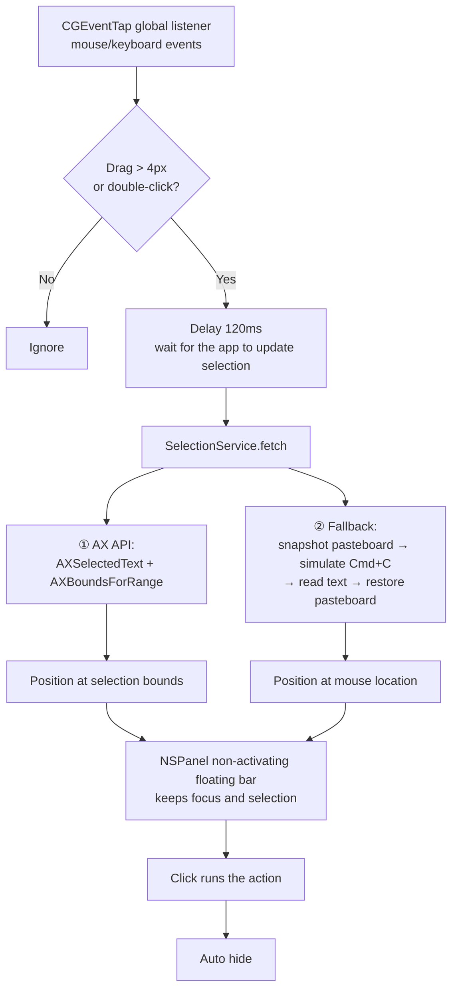

<p align="center">
  
</p>

<h1 align="center">PopBar</h1>

<p align="center">
  A macOS selection popup bar — select text, get a menu.<br>
  Pure Swift + AppKit, no Xcode project required, single-command build.
</p>

<p align="center">
  <a href="README.md">中文</a> | English
</p>

<p align="center">
  <br>
  
</p>

<p align="center">
  <video src="https://github.com/user-attachments/assets/1857be08-837e-4c7e-bb0b-44d6773929cd" poster="docs/popbar-promo-poster.png" width="720" controls muted></video><br>
  <a href="docs/popbar-promo-v1.0.mp4">▶ Watch the promo</a> · <sub>52s: select-to-pop · context-aware actions · AI translation panel · privacy masking</sub>
</p>

## Features

- **Select & pop**: after a drag or double-click selection, a floating bar appears above the selection
- **Built-in actions + customizable bar**: clipboard, text processing, search, translation, speech and more; reorder by drag, show/hide in Preferences, overflow folds into a "…" menu
- **AI translation panel**: works with any OpenAI-compatible service (DeepSeek / SiliconFlow / Ollama…); multiple providers stream translations side by side; supports **multi-turn follow-up**
- **Context aware**: detects URL / email / expression / timestamp / JSON / Base64 / URL-encoding / color / file path / phone / address / date / currency / unit, and appends matching buttons (up to 3)
- **Per-app rules**: sensitive apps (1Password, Terminal, …) can disable the bar entirely or keep only chosen actions; one click in the menu bar disables/enables it for the current app
- **Privacy first**: before AI requests, detects phone numbers, ID numbers, bank cards, emails, API keys, private keys, internal IPs — ask / auto-mask / off; clipboard history is off by default and never persisted by default
- **Extension system**: three types — URL template / Shell script (text via stdin, injection-safe) / Shortcut; live on config change
- **More built-in tools**: QR code generation, developer toolbox (HTML/Unicode escape, SHA256/MD5, JWT decode, JSON processing)
- **Menu bar translation entries**: screenshot OCR / input / clipboard — three ways to open the translation panel; screenshots and clipboard images are also scanned for QR codes
- **Clipboard history**: opt-in; paste or append from the menu bar; memory-only by default, concealed clipboard markers always skipped
- **Keyboard control**: configurable global hotkey; in keyboard mode ←/→ moves the highlight, Enter runs, Esc closes; the interceptor tap is auto-removed on timeout
- **Bilingual UI**: menu bar, floating bar, translation panel and both settings windows switch between Chinese and English instantly
- **Smart ordering suggestion**: driven by local usage stats (action counts only), suggests pinning a frequent action to the main bar at most once a week
- **Non-invasive capture**: Accessibility API first, falling back to simulated `Cmd+C` with automatic pasteboard restore
- **In-place replacement**: case conversion and the "→ Replace" items in the Dev menu rewrite the original text (pasteboard backed up and restored)
- **Light & dark themes**: frosted-glass material and icon colors follow the system appearance
- **Zero-dependency background app**: `LSUIElement`, no Dock icon, purely event-driven, idle CPU ≈ 0

## Button overview

| Icon | Action | Description |
|---|---|---|
| 📄 | Copy | Write selected text to the pasteboard |
| ✂️ | Cut | Simulates `Cmd+X` |
| Aa | Upper/Lower | In-place replace; all-uppercase becomes lowercase |
| 🔍 | Google | Opens search results in the browser |
| 🐾 | Baidu | Same, via Baidu |
| 💬 | AI Translate | Opens the multi-provider translation panel with streaming output; opens the settings window if no provider is configured |
| 🔊 | Speak/Stop | AVSpeechSynthesizer; Chinese text picks a Chinese voice automatically |
| #️⃣ | Word Count | Shows "X chars · Y words" right in the bar |
| 🔗 | Open Link | Only appears when the selection looks like a URL |
| ✉️ | Send Email | Only appears when the selection is an email address |
| ⊖ | Calculate | Only appears for expressions; copies the result |

> Hovering a bar button shows its name.
> At most 3 context buttons are shown, taken by detection priority: URL, email, calc,
> timestamp, JSON, color, file path, Base64, URL-encoding, currency, unit, phone, address, date.
> Extension actions, QR code, mask, Dev toolbox etc. can all be reordered and toggled in Preferences.

## Keyboard mode

Keyboard selection (Shift + arrows/Home/End/PgUp/PgDn, 0.45 s debounce) also pops the bar;
pressing the summon hotkey (default `ctrl+opt+space`, configurable in Preferences) enters **keyboard mode**:

- `←`/`→` move the highlight, `Enter` runs the action
- `Esc` closes; auto-exits after 30 s idle (prevents the tap from jamming the keyboard)

## Privacy & security

- **Sensitive info detection**: before AI requests, checks phone numbers / ID numbers / bank cards / emails / API keys / private keys / internal IPs; modes: ask / auto-mask / off; masking sends placeholders and restores them in the response; local providers (localhost / internal addresses) are let through directly
- **API keys stay local**: stored in plain text in the local config.json (permission 0600)
- **Secure fields exempt**: when a secure text field (AXSecureTextField) is focused, no capture happens at all — the pasteboard fallback is disabled too
- **Pasteboard protection**: the app's own writes are registered; history never stores temporary content from the capture fallback; ConcealedType / TransientType are always skipped
- **Extension isolation**: Shell / Shortcut extensions receive text only via stdin + environment variables, never interpolated into a command string; 10 s default timeout with SIGKILL
- **App blocklist**: capture can be fully disabled in sensitive apps; one click in the menu bar toggles the current app

## How it works



Key implementation notes:

- **Event listener**: `.cgSessionEventTap` + `listenOnly`, never blocks the system event stream
- **Capture fallback chain**: AX → pasteboard snapshot/restore (`(type, Data)` materialization avoids `writeObjects:` crashes from lazy-loading items)
- **Panel**: `NSPanel` + `.nonactivatingPanel` — clicking a button never steals focus or clears the selection, which simulating keystrokes to replace the selection depends on
- **Hover feedback**: `NSTrackingArea` + `.activeAlways`, still works for an accessory app
- **Chrome/Electron compat**: automatically sets `AXEnhancedUserInterface`

## AI translation panel

<p align="center">
  
</p>

Clicking the 💬 button on the bar opens a translation panel: the original text sits on top
(selectable, speakable); below it, one card per provider with the translation **streaming** in.
Each card has copy, speak and retry; a failing provider shows its own error without
affecting the others. The panel appears at the top-center of the screen; the 📌 button in
the top-left corner pins it (when pinned, clicking outside won't close it; Esc/✕ still does).

The menu bar offers three more triggers:

| Entry | Description |
|---|---|
| Screenshot Translate (OCR) | System region capture → Vision offline OCR (Chinese + English) → into the panel; requires Screen Recording permission, guided on first use; QR codes in the image are detected too and shown as a clickable result strip |
| Input Translate | The panel's source area becomes an input field; Enter submits, Shift+Enter inserts a newline; edit and re-translate freely |
| Clipboard Translate | Text is translated directly; images are OCR'd first |

Other menu items: master switch for the selection bar, one-click disable/enable for the
current app, clipboard history (shown when enabled), AI translation settings, Preferences,
Accessibility settings, Quit.
The left-click action on the menu bar icon can be changed to "Input Translate / Clipboard
Translate" in Preferences; right-click always opens the menu.

### Settings window

<p align="center">
  
</p>

Menu bar → "AI Translation…" opens the settings window: provider list on the left (green
dot = ready / orange = missing key or model / gray = disabled) with inline toggles and
**drag-to-reorder** (the order is the card order in the panel); name, Base URL, model, API
key, deep thinking and enabled state on the right; "+" offers presets like DeepSeek,
SiliconFlow, OpenAI, OpenRouter, Ollama; "Test Connection" makes a real request and shows
latency. Below: default language, timeout, max characters and temperature.
"Save" (⌘S) writes the config file; closing with unsaved changes prompts first.

### Preferences

<p align="center">
  
</p>

Menu bar → "Preferences…" (⌘,). Changes take effect **immediately** — no save button. The
window has four tabs: **General / Features / Toolbar / About**, and its height adapts to the
tab content (a tab scrolls internally when it exceeds the available screen height):

| Tab | Content |
|---|---|
| General | Appearance, language, tray icon, panel position, trigger, clipboard fallback, privacy guard, launch at login |
| Features | Clipboard history, history persistence, OCR result, usage stats, summon hotkey |
| Toolbar | Actions & ordering (drag), per-app rules |
| About | Version, config folder |

Item details:

| Item | Description |
|---|---|
| Appearance | System / Light / Dark; all windows and panels switch instantly |
| Language | System / English / 中文; menu bar, bar, panel switch instantly |
| Tray Icon | Left-click action on the menu bar icon: menu / input translate / clipboard translate (right-click always opens the menu) |
| Panel Position | Translation panel at top-center / at cursor |
| Trigger | Drag + double-click / drag only / double-click only |
| Clipboard Fallback | Whether to simulate ⌘C when AX can't read the selection (turning it off better protects pasteboard privacy) |
| Privacy Guard | Check sensitive content before AI requests: ask / auto-mask / off |
| Clipboard History | Records recent pasteboard items, pastable from the menu bar; off by default, memory-only |
| OCR Result | After screenshot recognition: translation panel / full action bar |
| Usage Stats | Counts actions only, never text; powers the weekly ordering suggestion; can be disabled |
| Summon Hotkey | Default `ctrl+opt+space`; format `ctrl+opt+space` |
| Launch at Login | SMAppService login item, synced with System Settings → Login Items |

The About tab shows the version and config folder, with a one-click Finder reveal.

### Config file

Config lives in `~/Library/Application Support/PopBar/config.json` (auto-created on first launch, permission 0600).

- **Loaded at launch, auto-reloaded at runtime**: PopBar watches the file; external edits take effect in ~0.3 s, no restart needed
- If the JSON is broken, the last valid config is kept and the settings window shows the error
- You can also write it by hand:

```json
{
  "appearance": "system",
  "language": "system",
  "trayClick": "menu",
  "panelPosition": "top",
  "triggerMode": "both",
  "clipboardFallback": true,
  "launchAtLogin": false,
  "sourceLanguage": "auto",
  "targetLanguage": "auto",
  "timeout": 30,
  "maxCharacters": 5000,
  "temperature": 0.2,
  "providers": [
    {
      "name": "DeepSeek",
      "baseURL": "https://api.deepseek.com/v1",
      "model": "deepseek-chat",
      "apiKey": "sk-your-key",
      "enabled": true
    },
    {
      "name": "Local Ollama",
      "baseURL": "http://127.0.0.1:11434/v1",
      "model": "qwen2.5:7b",
      "apiKey": "ollama",
      "enabled": true
    },
    {
      "name": "Word Explainer",
      "baseURL": "https://api.deepseek.com/v1",
      "model": "deepseek-chat",
      "apiKey": "sk-your-key",
      "enabled": true,
      "systemPrompt": "You are a professional vocabulary explainer.",
      "userPrompt": "Explain this word: {$query.text}"
    }
  ]
}
```

- Any **OpenAI-compatible** service works: fill in `baseURL` + `model` + `apiKey`; `enabled` toggles it
- **Deep thinking**: each provider can choose "default / on / off"; the wire format is adapted by domain (DeepSeek `thinking.type`, OpenRouter `reasoning`, Qwen/SiliconFlow/vLLM-style `enable_thinking`); unknown services use the generic form
- **Custom prompts**: with custom prompts enabled, a provider's system prompt and user message template can be changed (turning the bar into an explainer, rewriter, or any task). Template variables: `$query.text` (source text), `$query.detectFromLang`, `$query.detectToLang` (`{$…}` brace form also accepted); results still stream into the panel in translation style. An empty system prompt sends no system message
- `apiKey` is entered in the settings window and stored in plain text in the local config file (permission 0600, readable only by the current user)
- **Extensions**: `extensions` array; `type` is `url / shell / shortcut`; text is passed via `{text}`/`{rawtext}` template variables (url type) or stdin (shell/shortcut), shell also gets `POPBAR_TEXT / POPBAR_APP / POPBAR_BUNDLE_ID` env vars; `output` is `none / copy / replace / show / panel` (both show and panel open the result window); `match` (regex must hit to appear), `apps` (bundleID allowlist), `timeout` (kill after N seconds, default 10), `enabled`
- **Per-app rules**: `appRules`, each `{bundleID, name, mode, actions[]}`; `mode` is `disabled / custom`
- **Toolbar**: `toolbar.items` ordered as `{id, visible}`; `maxVisible` controls buttons on the main bar (default 12, adjustable 4–24), the rest go to the overflow menu; `contextPosition` is `afterEdit / front / back`; `order` is `manual / perApp` (perApp promotes frequently used actions in that app based on usage stats)
- **First-launch seeding**: with no config, a template is written containing 2 disabled provider templates (DeepSeek, SiliconFlow), 1 GitHub-search extension, and 5 preset app-disable rules (1Password / Bitwarden / Keychain Access / Screen Sharing / Windows App)
- **Others**: `clipboardHistory`, `ocr.after`, `usage.enabled`, `hotkeys`, `privacy` etc. can all be handwritten with defaults
- When `targetLanguage` is `auto`, direction is inferred from the source text (Chinese→English, otherwise→Chinese)
- The language dropdown in the panel changes direction for that session only — it's not written back
- Local services are supported (`http://127.0.0.1:...`, `NSAllowsLocalNetworking` is declared in Info.plist)

> ⚠️ When you use this feature, the selected text is sent to **the third-party API you configured** (or a local model).
> PopBar itself has no server and collects nothing, but the target provider's privacy policy applies to the request.
> `apiKey` is stored in plain text in the local config file (readable only by the current user); for safer storage, use a local model (e.g. Ollama).

## Build & install

```bash
./build.sh    # one command: compile → package build.noindex/PopBar.app → generate build/PopBar-<version>-<arch>.dmg
```

The app bundle is deleted and rebuilt cleanly every time; a same-name DMG is overwritten; the DMG staging directory is cleaned up automatically. Open the DMG, drag `PopBar.app` into `Applications`, and launch it from Applications. The app only shows a menu bar icon — no Dock icon. You can also run the local build directly: `open build.noindex/PopBar.app`. The build and staging directories use the `.noindex` suffix so the dev copy stays out of Spotlight app results.

Requirements: macOS 13+; building from source needs the Swift toolchain (Xcode or Command Line Tools).

> DMGs downloaded from GitHub Releases are not notarized by Apple, so the first launch reports
> "damaged and can't be opened". After dragging the app into `Applications`, run once in Terminal:
> `xattr -cr /Applications/PopBar.app`.

## Permissions

On first launch, grant **System Settings → Privacy & Security → Accessibility**:

- Global event listening (selection gesture detection)
- Reading selected text
- Simulating keystrokes (`Cmd+C/X/V`)

> The AI translation panel needs network access (outbound HTTPS); every other action works fully offline. Selected text is only sent to a service when you actively use search, online lookup or AI translation.

> Installing the DMG does not grant Accessibility automatically. If PopBar is missing from the list, click "+" on that page and choose `/Applications/PopBar.app`. If a `PopBar Dev` certificate exists on this machine it is used for signing, otherwise the app falls back to ad-hoc signing — neither is an Apple Developer ID signature nor notarization, so distribution to other machines may hit Gatekeeper, and Accessibility grants are not guaranteed to survive updates.

## Project structure

```
popbar/
├── Sources/
│   ├── main.swift                    # Entry point
│   ├── AppDelegate.swift             # Status item menu / permission guide
│   ├── SelectionMonitor.swift        # CGEventTap selection gestures + keyboard triggers
│   ├── SelectionService.swift        # AX capture + pasteboard fallback/snapshot restore
│   ├── FloatingBarController.swift   # Bar UI, keyboard mode, info strips
│   ├── BarAction.swift               # Action model + ActionRegistry registration/ordering/split
│   ├── BuiltinActions.swift          # Built-in actions
│   ├── SourceContext.swift           # Context of one capture (text/selection/app)
│   ├── TextReplacer.swift            # In-place replacement (pasteboard backed up & restored)
│   ├── PasteboardGuard.swift         # Pasteboard write registry & snapshot restore
│   ├── ContextDetector.swift         # Context detection (URL/email/calc/timestamp/JSON/color…)
│   ├── TranslationPanel.swift        # AI translation/action panel (provider cards + follow-up)
│   ├── LLMClient.swift               # OpenAI-compatible streaming client (multi-turn messages)
│   ├── PopBarConfig.swift            # config.json structure, path, read/write
│   ├── ConfigStore.swift             # Load at launch + file-watch hot reload + change notification
│   ├── SettingsWindow.swift          # AI settings window (provider CRUD, test connection)
│   ├── PreferencesWindow.swift       # Preferences (General/Features/Toolbar/About, instant apply)
│   ├── PrefsSections.swift           # Toolbar ordering card / app rules card
│   ├── TranslateTriggers.swift       # Screenshot OCR / input / clipboard translate triggers
│   ├── SensitiveGuard.swift          # Sensitive-info detection, placeholder masking, gating
│   ├── Extensions.swift              # URL/Shell/Shortcut extension runner
│   ├── DevTools.swift                # Developer toolbox (escape/hash/JWT/JSON)
│   ├── ClipboardHistory.swift        # Clipboard history (off by default, memory-only)
│   ├── UsageStats.swift              # Usage stats & weekly smart suggestion
│   ├── KeyboardTrigger.swift         # Hotkey parsing + keyboard-mode interceptor tap
│   ├── QRCodePanel.swift             # QR code from selection (CoreImage, offline)
│   ├── L10n.swift                    # Chinese/English UI strings
│   ├── Actions.swift                 # CGEvent keystroke simulation (incl. flagsChanged)
│   ├── AppActivation.swift           # Accessory-app foreground activation / Esc-closable window
│   ├── BarTooltip.swift              # Hover tooltip (custom-drawn for non-activating panels)
│   └── Screen.swift                  # CG/AX ↔ Cocoa coordinate conversion
├── tests/                            # Pure-logic tests + popup-visibility lint (tests/run.sh)
├── shot/main.swift                   # Screenshot tool (standalone binary, reuses Sources)
├── icon/make_icon.swift              # Icon generator (vector drawing → iconset)
├── Resources/AppIcon.icns
├── Info.plist                        # LSUIElement / version / permission usage strings
├── docs/                             # README screenshots
├── build.sh                          # App/DMG packaging
├── restart.sh                        # Kill old process → build → launch dev copy
├── build/                            # Build artifacts & DMG (not committed)
└── build.noindex/                    # Dev app & packaging staging (excluded from Spotlight)
```

## Helper scripts

```bash
# Restart PopBar: kill the running instance → build → launch the dev copy
# (the most common command after code changes)
./restart.sh              # build + restart
./restart.sh --no-build   # restart only
./restart.sh --fg         # run in foreground, logs straight to the terminal (Ctrl+C to quit)

# Run tests: pure-logic assertions + popup-visibility lint
# (every window/dialog must activate the app before showing)
./tests/run.sh

# Regenerate the icon (after changing colors/layout in icon/make_icon.swift)
swift icon/make_icon.swift icon/PopBar.iconset icon/preview.png
iconutil -c icns icon/PopBar.iconset -o Resources/AppIcon.icns

# Regenerate the bar screenshots used in the README (light + dark)
swiftc -O -o build/shot $(ls Sources/*.swift | grep -v '/main.swift$') shot/main.swift
./build/shot docs/popbar-bar-light.png docs/popbar-bar-dark.png
```

## Known limitations

- AI translation only supports the OpenAI-compatible protocol; native Claude / Gemini APIs need their own adapters
- In apps with no AX support at all, capture relies on the pasteboard fallback and positioning degrades to the mouse location
- OCR uses offline Vision recognition; accuracy is limited for long passages and small fonts
- The extension system has three lightweight types (URL/Shell/Shortcut); YAML+JS-style plugins are not supported
- No Developer ID signing or Apple notarization yet; the DMG is fine for local installs/internal testing — public distribution needs proper signing and notarization per Apple requirements

## License

For learning and exchange only.
